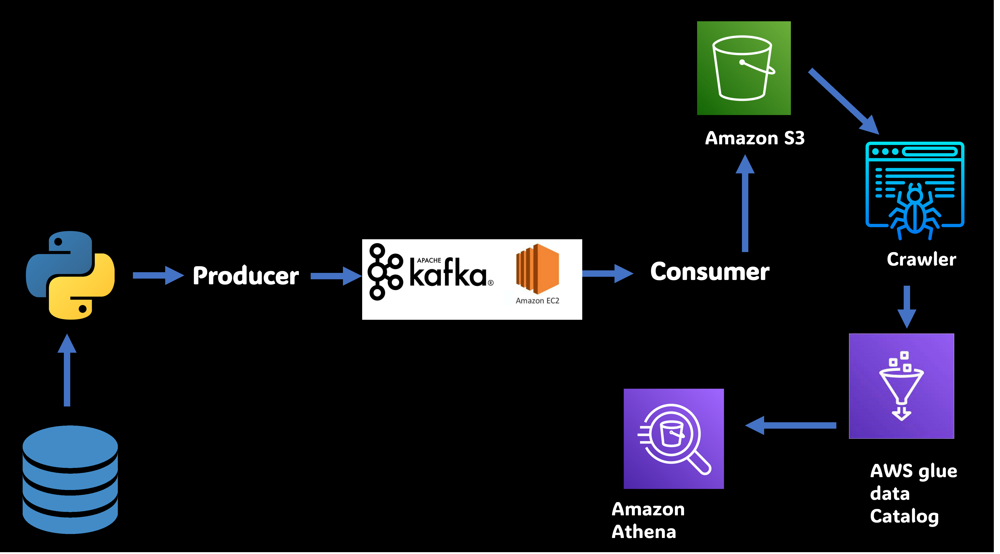

# Real-Time Stock Market Data Ingestion Pipeline

## Introduction 
This initiative establishes a comprehensive Real-Time Stock Market Data Ingestion pipeline utilizing Apache Kafka, 
AWS EC2, S3, Glue, and Athena. The pipeline comprises steps for initializing an EC2 instance, setting up 
and configuring essential packages, crafting Kafka topics, generating and absorbing real-time data, and querying the data through AWS Athena.


## Architecture 



## Technology Used
- Programming Language - Python
- Amazon Web Service (AWS)
1. S3 (Simple Storage Service)
2. Athena
3. Glue Crawler
4. Glue Catalog
5. EC2
- Apache Kafka


## Dataset Used
Here is the dataset used in the project - https://github.com/rita2002-max/stock-market-kafka-data-engineering-project/blob/main/indexProcessed.csv


## Getting Started


### Step 1: Launching an EC2 Instance
Deploy an EC2 instance with default configurations.
Establish a Security Group that permits traffic from all IP addresses for internet accessibility.


### Step 2: Logging in to the Instance using SSH
Download the primary key and relocate it to the project directory.
Establish an SSH connection to the instance employing the provided command from the Connect section.


### Step 3: Installing and Downloading Required Packages
Installing JAVA on the EC2 instance:

```bash
wget https://download.oracle.com/java/20/latest/jdk-20_linux-x64_bin.rpm
sudo rpm -Uvh jdk-20_linux-x64_bin.rpm
export JAVA_HOME=/usr/java/jdk-20.0.1
export PATH=$PATH:/usr/java/jdk-20.0.1/bin
```

Downloading Kafka onto the instance:

```bash
wget https://downloads.apache.org/kafka/3.5.1/kafka_2.12–3.5.1.tgz
tar -xvf kafka_2.12–3.5.1.tgz
```

### Step 4: Launching the Zookeeper

```bash
cd kafka_2.12-3.5.1
bin/zookeeper-server-start.sh config/zookeeper.properties
```

### Step 5: Initializing the Kafka Server

```bash
export KAFKA_HEAP_OPTS="-Xmx256M -Xms128M"
cd kafka_2.12-3.5.1
bin/kafka-server-start.sh config/server.properties
```

### Step 6: Creating the Topic

```bash
cd kafka_2.12-3.5.1
bin/kafka-topics.sh --create --topic demo_testing2 --bootstrap-server {Public IP:9092} --replication-factor 1 --partitions 1
```

### Step 7: Activating the Producer

```bash
cd kafka_2.12-3.5.1
bin/kafka-console-producer.sh --topic demo_testing2 --bootstrap-server {Public IP:9092}
```

### Step 8: Initiating the Consumer

```bash
cd kafka_2.12-3.3.1
bin/kafka-console-consumer.sh --topic demo_testing2 --bootstrap-server {Public IP:9092}
```
### Step 9: Python Code for Data Generation (Producer)
Launch a Jupyter Notebook, install kafka-python, and script the producer code.


### Step 10: Python Code for Data Consumption (Consumer)
In a separate notebook, introduce the consumer employing the provided statements.


### Step 11: Write Data to AWS S3
Install the s3fs package and utilize Python code to inscribe data to an S3 bucket.

###  Step 12: Implementation of an AWS Glue Crawler
Craft a Glue Crawler to index metadata from the S3 bucket.

### Step 13: Leveraging AWS Athena for Data Querying
Unfold the AWS Athena editor, select the database and table, and compose SQL queries.

